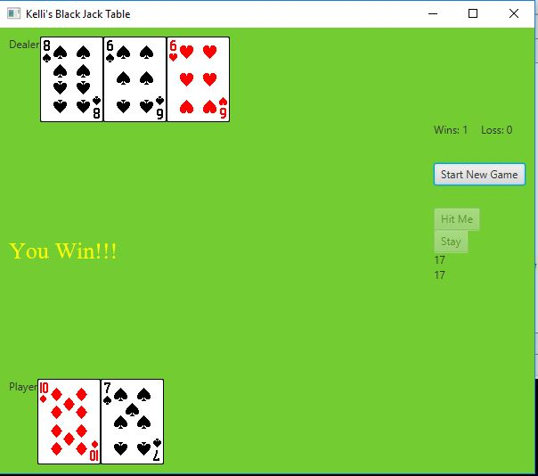
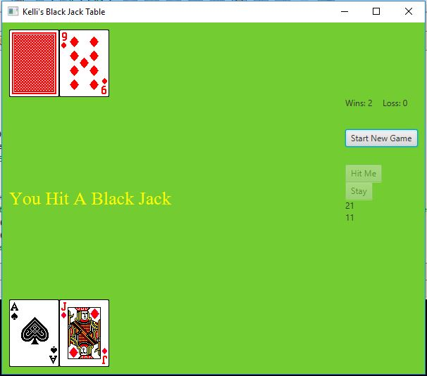
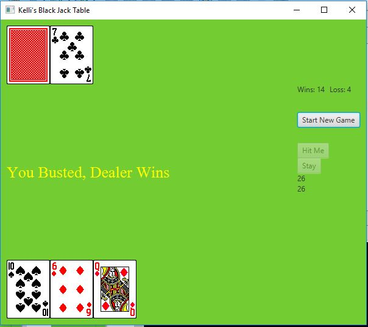
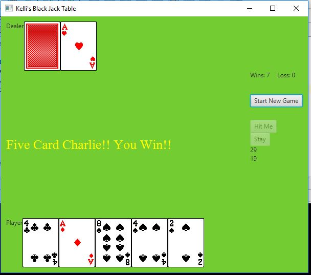

# Black Jack Final

Create a program in which a user plays a simple version of the card game 21 against the computer. Each player is initially dealt two cards from a standard deck of 52. Random numbers will represent the cards from 1 to 10. After seeing their hand the user then the house (computer) are given the opportunity to take additional cards (hit me). The hand that comes the closest to 21 without exceeding 21 wins the game.

This application should use GUI elements to show the player their cards. You may use the attached card set or your own. Your application should have a way to:

- shuffle the deck
- a way to deal cards to the players
- Show the current score based on hands won / hands lost

## Example Output

## Analysis Steps

The biggest obstacle that I faced was trying to figure out how I was going to make the deck of cards and be able to to keep the values and the image.
After I got that down then I created the scene. 
Next, I worked on adding the 4 original cards being dealt.
Then I work on adding the additional cards for the player and the dealer
I worked on the logic side on how to determine if there was a winner, black jack, or if there was a bust
Next I added the buttons and my labels. 
Applied my event handlers for the buttons.
Then I added in the wins and losses for the game stats. 

### Design

This was a JavaFX Game I used the Start class and the Main class
I used the Deck class to create an array list of 52 and then to shuffle the array list.
I used the Card class to assign the card's image and value.

### Testing
At first I was determine that I should make a 2D Array that would hold all my values. Towards the end of completing the array, I came up with a cardIDNumber.
I realized instead of making the array that I could use an object using the cardIDNumber then applying the properties that I needed for each card.
Luckily, I was able to reuse most of my code from when I did my array list to help me do my class.
After making my classes for the deck and the card I realized an ArrayList would be better suited for this project so I made the changes.

I did some testing every step of the way, anytime I added an element I made sure it worked before moving on. I did have a label that held the dealer totals
so that I could ensure that the methods for the dealer were correct. I didn't remove these until the very end when I knew that everything was functioning properly.
I did have a global variables, I did play some around with trying to make less global variable.
Not having global variables made the program less functional.

I did try to implement a betting system. I was unable to get it to update the balance properly. I wish I could have got it
working correctly under every circumstance. I deleted the betting class from the system just a little while ago. 
That the program does look cleaner and functions better without it.

## Notes
Thanks for the wonderful semester Renee!!!!

